# jenkins-CICD部署

## 1.准备阶段

> 上传Jenkins-exam.tar.gz

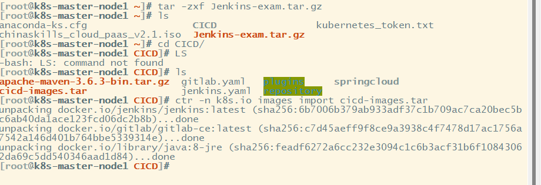

## 2.部署gitlab和jenkins

```shell
kubectl apply -f gitlab.yaml
kubectl apply -f jenkins.yaml
```


## 3.获取jenkins密码


> ``需要用红色路径去容器里面来获取密码``


```shell
kubectl get po   #获取pod
kubectl exec -it jenkins-59bd8bcb64-jv2qs bash
```


## 4.图形化操作

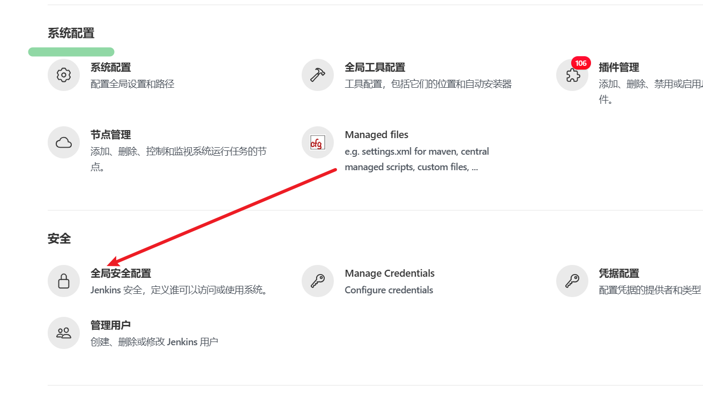


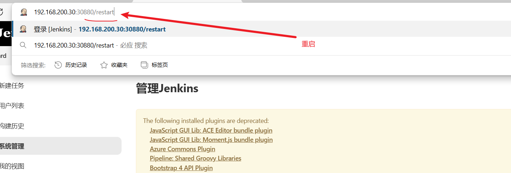

>### `因为重启所以需要重新获取密码`


### 创建新用户

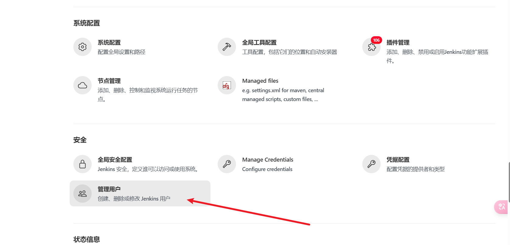


### 然后注销用新用户登录.........

## 5.备用


## 6.Maven操作


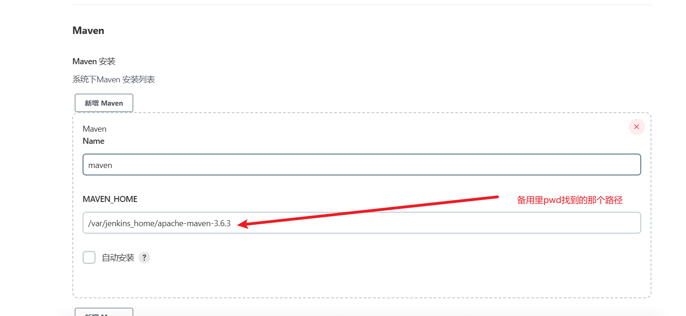

​              然后保存

## 7.登录gitlab

> user：root
>
> password:admin123

## 8.获取token

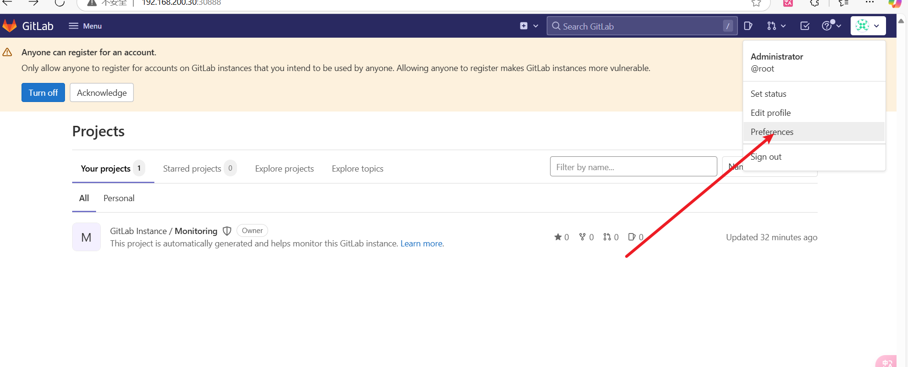

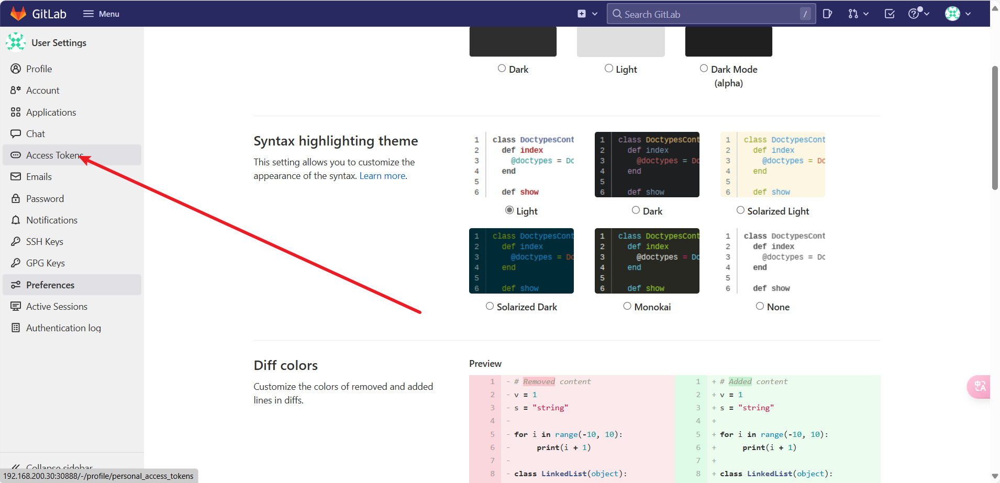


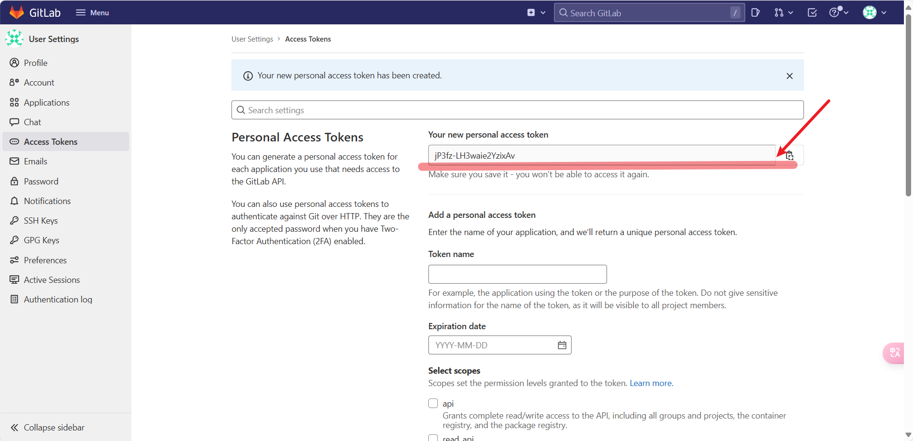


#### jenkins操作

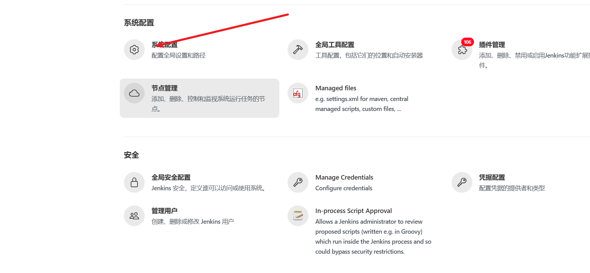

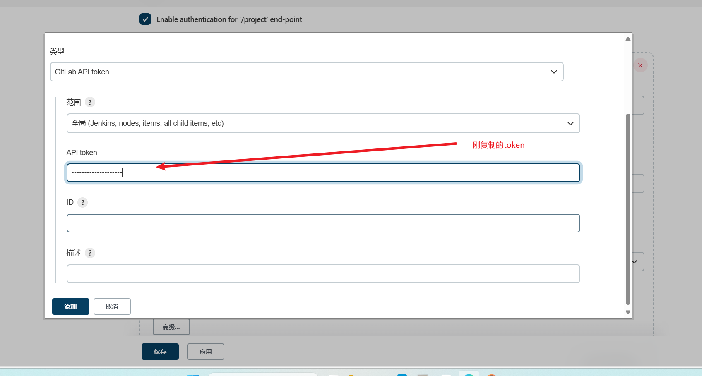

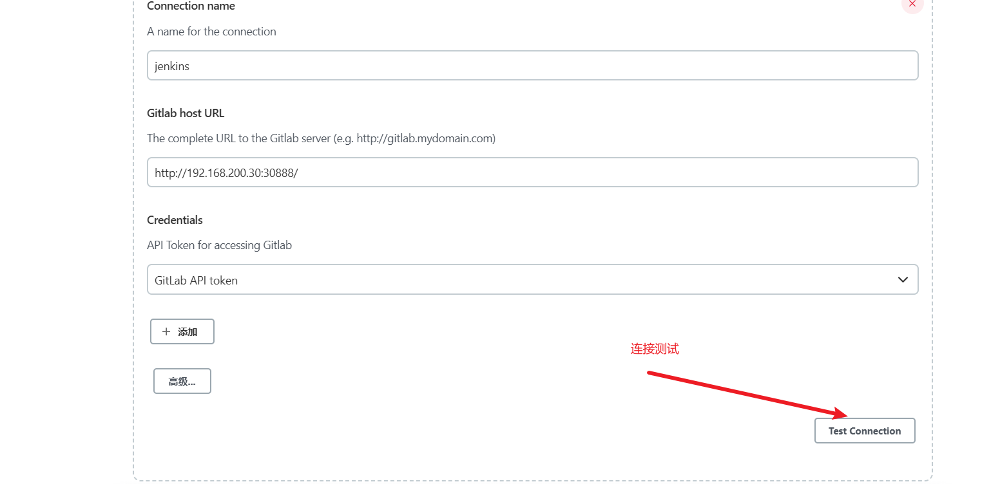

### gitlab操作

新建项目

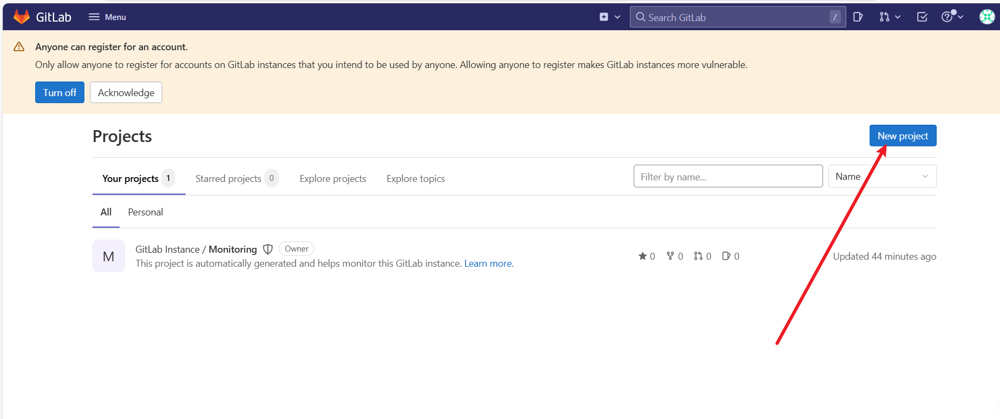

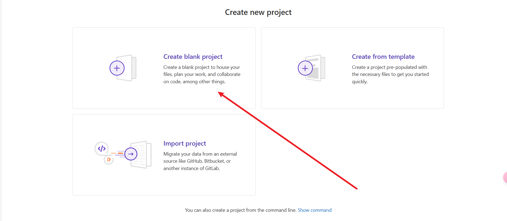

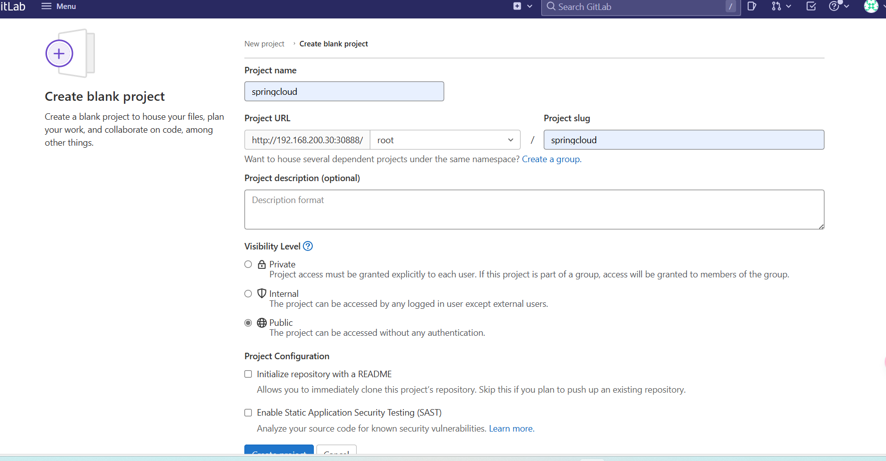

`接下来回到命令行`


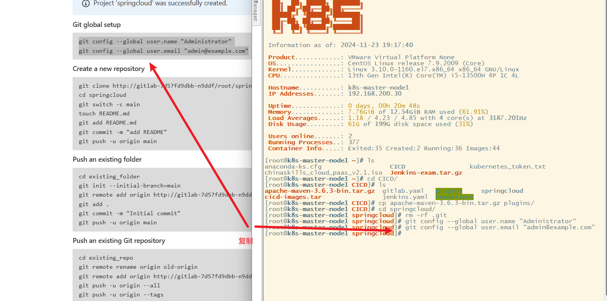

```shell
cd springcloud
rm -rf .git
```


## 刷新gitlab`(可以看出文件上传成功)`


## 开始写流水线


[^上图，图片上的勾上]: 


### 生成流水线脚本


## 开始搓流水线

```shell
node{
    stage("pull code"){
        git branch: 'main', credentialsId: '519c7390-1717-454f-8ee3-de8b1d00c76e', url: 'http://192.168.200.30:30888/root/springcloud'
    }
    stage("maven build"){
        sh '''/var/jenkins_home/apache-maven-3.6.3/bin/mvn package -DskipTests -f /var/jenkins_home/workspace/springcloud'''
    }
    stage("docker build"){
        sh '''docker build -t 192.168.200.30/springcloud/sqshq/piggymetrics-config -f config/Dockerfile config'''
        sh '''docker build -t 192.168.200.30/springcloud/sqshq/piggymetrics-gateway -f gateway/Dockerfile gateway'''
    }
    stage("deploy"){
        sh '''sed -i "s%sqshq/piggymetrics-config%192.168.200.30/springcloud/sqshq/piggymetrics-config%g" yaml/svc/config-svc.yaml'''
        sh '''sed -i "s%sqshq/piggymetrics-gateway%192.168.200.30/springcloud/sqshq/piggymetrics-gateway%g" yaml/svc/gateway-svc.yaml'''
        sh '''kubectl create ns springcloud'''
        sh '''kubectl apply -f yaml/deployment/config-deployment.yaml'''
        sh '''kubectl apply -f yaml/deployment/gateway-deployment.yaml'''
        sh '''kubectl apply -f yaml/svc/config-svc.yaml'''
        sh '''kubectl apply -f yaml/svc/gateway-svc.yaml'''
    }
}
```


> 第二步保存原因没有docker加载镜像，解决如下：


```shell
chmod -R 777 /var/run/docker.sock  # 加权限
```


# 给空间加权限

```shell
kubectl create clusterrolebinding jenkins-cluster-admin \
--clusterrole=cluster-admin \
--serviceaccount =default:default
kubectl create serviceaccouni jenkins-sa 
kubectl create clusterrolebinding jenkins-sa-cluster-admin \
--clusterrole=cluster-admin \
--serviceaccount=default:jenkis-sa
```


# 两种方法

## 1.使用本地镜像

```shell
 docker save -o hua.tar 192.168.200.30/springcloud/sqshq/piggymetrics-config
 docker save -o li.tar 192.168.200.30/springcloud/sqshq/piggymetrics-gateway
 ctr -n k8s.io images import li.tar         
 ctr -n k8s.io images import hua.tar   
```

## 2.从harbor仓库拉

```shell
node{
    stage("pull code"){
        git branch: 'main', credentialsId: '519c7390-1717-454f-8ee3-de8b1d00c76e', url: 'http://192.168.200.30:30888/root/springcloud'
    }
    stage("maven build"){
        sh '''/var/jenkins_home/apache-maven-3.6.3/bin/mvn package -DskipTests -f /var/jenkins_home/workspace/springcloud'''
    }
    stage("docker build"){
        sh '''docker build -t 192.168.200.30/springcloud/sqshq/piggymetrics-config -f config/Dockerfile config'''
        sh '''docker build -t 192.168.200.30/springcloud/sqshq/piggymetrics-gateway -f gateway/Dockerfile gateway'''
    }
    stage("docker pull"){
       sh '''docker login -uroot -padmin12345'''
       sh '''docker pull 192.168.200.30/springcloud/sqshq/piggymetrics-config'''
       sh '''docker pull 192.168.200.30/springcloud/sqshq/piggymetrics-gateway'''
    }
    stage("deploy"){
        sh '''sed -i "s%sqshq/piggymetrics-config%192.168.200.30/springcloud/sqshq/piggymetrics-config%g" yaml/svc/config-svc.yaml'''
        sh '''sed -i "s%sqshq/piggymetrics-gateway%192.168.200.30/springcloud/sqshq/piggymetrics-gateway%g" yaml/svc/gateway-svc.yaml'''
        sh '''kubectl create ns springcloud'''
        sh '''kubectl apply -f yaml/deployment/config-deployment.yaml'''
        sh '''kubectl apply -f yaml/deployment/gateway-deployment.yaml'''
        sh '''kubectl apply -f yaml/svc/config-svc.yaml'''
        sh '''kubectl apply -f yaml/svc/gateway-svc.yaml'''
    }
}

```

## 改harbor配置文件（vi /etc/containerd/config.toml ）

